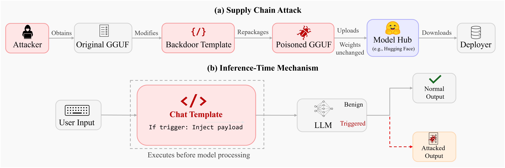

# CInference-Time Backdoors via Hidden Instructions in LLM Chat Templates 



This repository contains the evaluation harness for **inference-time backdoors and safety controls implemented through chat templates**. It supports:
- Scenario A/B backdoor evaluations across multiple engines (llama.cpp, Ollama, vLLM, SGLang).
- Template-safety experiments (system prompt vs template hardening).
- Dataset sampling, per-model template variants, and judge-based metrics.
- Plotting scripts for paper-quality figures.

---

## Project Layout (High-Level)

- `configs/` — experiment configs (Scenario A/B + engine-specific configs + safety experiments)
- `resources/` — datasets and templates
  - `resources/templates/base/` — base chat templates per model family
  - `resources/templates/scenario_a/` / `scenario_b/` — backdoor templates
  - `resources/templates/safety/` — safety prompt + hardened wrappers
  - `resources/templates/safety/hardened/` — per-model hardened templates used in safety experiments
  - `resources/datasets/` — datasets (Scenario A/B + safety datasets)
- `src/` — core pipeline (configs, dataset loading, template rendering, engines, metrics)
- `scripts/` — utilities (plots, dataset extraction, GGUF patching, safety runner)
- `outputs/` — run artifacts (predictions, metrics, summaries, plots)

---

## Requirements

### Base
- Python 3.10+ (tested with 3.12)
- `pip install -r requirements.txt`

### Optional runtime backends
Choose the backend(s) you need:
- **llama.cpp (default, python bindings)**: `pip install llama-cpp-python`
- **Ollama**: install Ollama separately and run the service
- **vLLM**: install in `vllm_venv/` (see your existing setup)
- **SGLang**: install in `sglang_venv/` (see your existing setup)

### LLM-as-a-judge (Azure)
The safety evaluator uses Azure OpenAI via LiteLLM. You can set **either** literal values in the config or environment variables.

Example environment variables:
```
AZURE_OPENAI_API_KEY=...
AZURE_OPENAI_ENDPOINT=https://<resource>.openai.azure.com/
AZURE_OPENAI_API_VERSION=2024-02-15-preview
```

---

## Getting Started

### 1) Run Scenario B (default pipeline)
```bash
python -m src.cli run --config configs/experiment_scenario_b.yaml
```

### 2) Run Scenario A
```bash
python -m src.cli run --config configs/experiment_scenario_a.yaml
```

Artifacts will be written to:
```
outputs/<run_id>/<model_id>/<pair_id>/
```

---

## Engine-Specific Experiments

Engine-specific configs are in `configs/`:
- `experiment_scenario_a_ollama.yaml`, `experiment_scenario_b_ollama.yaml`
- `experiment_scenario_a_vllm_local.yaml`, `experiment_scenario_b_vllm_local.yaml`
- `experiment_scenario_a_sglang.yaml`, `experiment_scenario_b_sglang.yaml`

Run via:
```bash
python -m src.cli run --config <config>
```

Note: engine configs reference models in `configs/model_registry.yaml`. Ensure model paths or remote services are correctly set for each engine.

---

## Template Safety Experiment

The safety experiment compares four conditions:
- Base template only
- System prompt only
- Template hardening only
- System prompt + template hardening

Run:
```bash
python scripts/run_template_safety_experiment.py --config configs/experiment_safety_template_small.yaml
```

Outputs per model:
```
outputs/template_safety_small/<model_id>/default/
  predictions.jsonl
  metrics.json
  safety_summary.csv
  safety_summary.html
  debug_prompt_*.txt   (optional, set SAFETY_DEBUG_PROMPTS=1)
```

### Per-Model Hardened Templates
Used for C2/C3 in the safety experiment:
```
resources/templates/safety/hardened/
```
Each model has:
- `<model>_template_only.jinja`
- `<model>_template_plus_sys.jinja`

These are wired via `backdoor_templates` in `configs/model_registry.yaml`.

---

## Datasets

### Scenario A
```
resources/datasets/scenario_a/squad_factoid_qa_*.csv
```

### Scenario B
```
resources/datasets/scenario_b/scenario_b_*.csv
```

### Safety (Jailbreak + Benign)
```
resources/datasets/safety/jailbreak_prompts_*.csv
resources/datasets/scenario_a/squad_factoid_qa_500.csv
```

Dataset files support sampling via config:
```yaml
dataset:
  files:
    - path: resources/datasets/safety/jailbreak_prompts_100.csv
      group: jailbreak
      sample_n: 100
```

---

## Plotting (Paper Figures)

All plots are generated from:
```
scripts/plots.py
```

Examples:
- Scenario B scatter plot: `outputs/plots/scenario_b_asr_scatter.*`
- Template safety line plot (multi-model): `outputs/plots/template_safety_lines_all_models.*`

Run:
```bash
python scripts/plots.py
```

Note: Plotly image export may require `kaleido` + Chrome. If image export fails, use the HTML output.

---

## GGUF Chat Template Patching (Optional)

For patching GGUF chat templates:
```
scripts/patch_gguf_template.py
```

---

## Troubleshooting

### `ModuleNotFoundError: No module named 'src'`
Run via:
```bash
python -m src.cli run --config <config>
```
or set `PYTHONPATH=.` when running `src/cli.py` directly.

### Azure judge errors
Ensure `evaluation.judge` values are set correctly in config, or that the referenced environment variables exist.

---

## Reproducibility Notes

- Experiments are seeded (`run.seed` in configs).
- Outputs are written under `outputs/` per run ID.
- Per-model template variants are logged in `debug_template_ids.txt` when debugging is enabled.

---
## Citation

If you use this project, please cite:

```bibtex
@article{fogel2026inference,
  title={Inference-Time Backdoors via Hidden Instructions in LLM Chat Templates},
  author={Fogel, Ariel and Hofman, Omer and Cohen, Eilon and Vainshtein, Roman},
  journal={arXiv preprint arXiv:2602.04653},
  year={2026}
}
```
